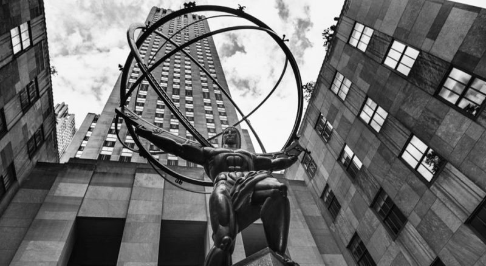
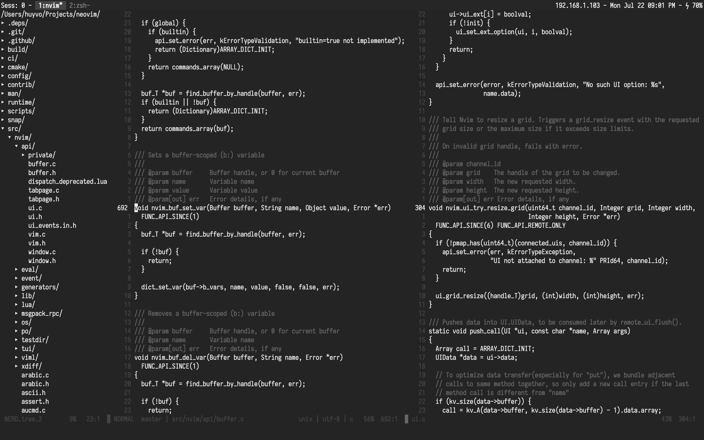

> "What is man? He's just a collection of chemicals with delusions of grandeur."

### Installation

```vim
Plug 'huyvohcmc/atlas.vim'
```

Then `:PlugInstall`.

### Usage

```vim
colorscheme atlas
```

### Lightline config

```vim
let g:lightline.colorscheme = 'atlas'
```

### Screenshots or it didn't happen



### Thanks

This colorscheme is a fork of [jacoborus/tender.vim](https://github.com/jacoborus/tender.vim) but without the colors of course.
